# Phân Tích Kiến Trúc MapLibre Native

> Nguồn phân tích: repository `maplibre/maplibre-native`, clone tại commit `103a1447c043c36cf48ba18d9db735949bfcb360` ngày 2026-05-17. Tài liệu này dựa trên source code trong `include/mbgl`, `src/mbgl`, `platform/android`, `platform/ios`, `platform/darwin`, `docs`, `ARCHITECTURE.md` và các design proposal về rendering modularization, Metal, plugin layers.

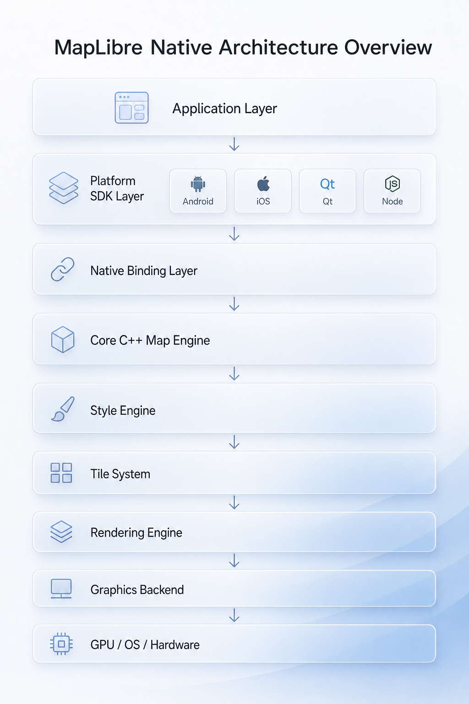

## 3.1. Executive Summary

MapLibre Native là một native map rendering engine mã nguồn mở, kế thừa từ Mapbox GL Native, dùng C++ core để render bản đồ vector/raster bằng GPU trên Android, iOS, macOS, Linux, Windows và các platform wrapper khác. Nó giải quyết bài toán khó nhất của bản đồ số trên thiết bị: biến dữ liệu địa lý dạng tile, style JSON, glyph, sprite, camera state và input người dùng thành frame bản đồ mượt, tương tác, tiết kiệm tài nguyên.

Native map engine cần thiết vì bản đồ hiện đại không chỉ là ảnh nền. Một app navigation phải xoay/nghiêng/zoom liên tục, đặt nhãn không va chạm, cập nhật route/traffic/location theo thời gian thực, cache offline, và vẫn giữ 60 fps trong điều kiện mạng yếu. Web map engine mạnh về portability, nhưng native engine kiểm soát tốt hơn lifecycle, GPU backend, memory, threading, cache, gesture và tích hợp platform.

Giá trị kiến trúc cốt lõi của MapLibre Native nằm ở bốn quyết định:

| Giá trị | Ý nghĩa thực tế |
| --- | --- |
| C++ core cross-platform | Một engine bản đồ dùng chung cho nhiều SDK, giảm phân mảnh hành vi giữa Android/iOS. |
| Declarative style | Style JSON tách mô tả bản đồ khỏi code app, giúp đổi theme/data/layer mà không đổi engine. |
| Tile-based scalability | Chỉ tải, parse, cache và render phần bản đồ liên quan tới viewport. |
| GPU-first rendering | Geometry, texture atlas, layer group, render pass và draw call được tổ chức cho pipeline đồ họa native. |

MapLibre Native phù hợp với sản phẩm cần bản đồ tương tác sâu: logistics, ride-hailing, navigation, delivery, asset tracking, field service, GIS mobile, outdoor/offline maps, automotive display, map design tools.

Với Gofa hoặc app dẫn đường, bài học lớn nhất không phải là “copy renderer”, mà là giữ ranh giới rõ: product/navigation logic ở trên, map core ở giữa, GPU/tile/cache ở dưới. Gofa có thể dùng MapLibre Native trực tiếp để tăng tốc sản phẩm, custom layer/source cho route, traffic, ETA, vehicle marker; chỉ nên fork khi cần thay đổi renderer, cache/offline policy hoặc platform backend mà upstream chưa hỗ trợ.

## 3.2. First Principles Analysis

Bản đồ số là một mô hình không gian được trình bày qua nhiều lớp dữ liệu. Ở tầng dữ liệu, nó gồm feature địa lý: điểm, đường, polygon, thuộc tính, độ cao, label, imagery. Ở tầng hiển thị, nó là một camera nhìn vào một mặt phẳng chiếu địa lý, lấy dữ liệu quanh viewport, áp style, rồi render ra frame.

Vector tile là một gói dữ liệu địa lý nhỏ, thường ở chuẩn MVT, chứa geometry và thuộc tính trong một ô tile. Raster tile là ảnh đã render sẵn. Vector tile cho phép đổi style runtime, hiển thị sắc nét ở nhiều DPI, chọn ngôn ngữ label, lọc feature, query feature, vẽ route/traffic chính xác. Raster tile đơn giản và rẻ CPU hơn, nhưng bị khóa vào style, zoom quá mức dễ mờ, khó query và khó cá nhân hóa.

Không thể chỉ dùng bitmap tile cho app navigation vì app cần xoay bản đồ theo hướng đi, đặt lại nhãn theo pitch/bearing, highlight route, cập nhật traffic, offline theo vùng, và kết hợp location/annotation động. Bitmap tile là kết quả cuối; vector tile là nguyên liệu. Navigation cần nguyên liệu.

Renderer riêng là cần thiết vì pipeline bản đồ có nhiều bước đặc thù: tile cover, overscaled tile, symbol collision, glyph atlas, sprite atlas, layer ordering, opaque/translucent pass, heatmap/offscreen target, tile fading, debug overlays. Những bước này không thể giao hoàn toàn cho UI toolkit phổ thông.

Native engine khác web map engine ở điểm nó sống trong lifecycle hệ điều hành. Android cần `Surface`, `GLThread`, JNI, lifecycle `onStart/onStop/onLowMemory`. iOS cần `UIView`, `MTKView`/`CAEAGLLayer`, run loop, gesture recognizer, memory warning. Native engine cũng có thể chọn Metal/Vulkan/WebGPU/OpenGL ở compile/runtime boundary.

Camera, style, source, layer, tile và renderer phải tách riêng vì chúng thay đổi theo nhịp khác nhau:

| Thành phần | Nhịp thay đổi | Vì sao phải tách |
| --- | --- | --- |
| Camera/viewport | Mỗi gesture/frame | Không nên reparse style khi người dùng pan/zoom. |
| Style | Khi đổi theme/layer/property | Cần diff để chỉ cập nhật phần bị ảnh hưởng. |
| Source | Khi đổi dữ liệu | Một source có thể phục vụ nhiều layer. |
| Tile | Theo viewport/zoom/network | Tải và parse độc lập từng ô để scale. |
| Renderer | Theo GPU frame | Cần state riêng, command riêng, backend riêng. |

## 3.3. Tổng Quan Kiến Trúc Hệ Thống

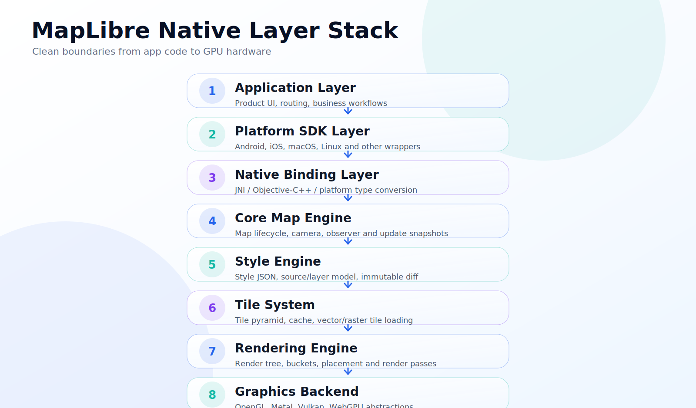

| Tầng | Vai trò | Source tiêu biểu |
| --- | --- | --- |
| Application Layer | Code app: route, tracking, business flow, UI ngoài map. | App tích hợp SDK. |
| Platform SDK Layer | API native cho Android/iOS, lifecycle, gesture, view, annotation. | `platform/android/MapLibreAndroid`, `platform/ios`, `platform/darwin`. |
| Native Binding Layer | Chuyển Java/Kotlin/ObjC/Swift API sang C++ core. | `NativeMapView`, `MLNMapView`, `MLNRenderFrontend`. |
| Core Map Engine | Quản lý `Map`, camera, style, observer, update parameters. | `src/mbgl/map`, `include/mbgl/map`. |
| Style Engine | Parse style, runtime styling, immutable `Layer::Impl`/`Source::Impl`, diff. | `src/mbgl/style`, `include/mbgl/style`. |
| Tile System | Tile pyramid, tile loader, vector/raster/GeoJSON tile, worker parse/layout. | `src/mbgl/tile`, `src/mbgl/renderer/tile_pyramid.hpp`. |
| Rendering Engine | Render source/layer, placement, buckets, render tree, passes. | `src/mbgl/renderer`, `src/mbgl/layout`, `src/mbgl/text`. |
| Graphics Backend | API trừu tượng cho OpenGL, Metal, Vulkan, WebGPU. | `src/mbgl/gfx`, `src/mbgl/gl`, `src/mbgl/mtl`, `src/mbgl/vulkan`, `src/mbgl/webgpu`. |

## 3.4. Phân Tích Cấu Trúc Source Code

| Khu vực source | Vai trò | Thành phần chính | Ý nghĩa kiến trúc |
| --- | --- | --- | --- |
| `include/mbgl` | Public C++ API và interface cross-platform | `map`, `style`, `renderer`, `storage`, `gfx`, `tile` | Ranh giới ổn định giữa core và platform/binding. |
| `src/mbgl/map` | Map lifecycle và camera state | `Map::Impl`, `Transform`, `TransformState`, `MapProjection` | Nơi gom style/camera/renderer thành update snapshot. |
| `src/mbgl/style` | Style object model | `Style::Impl`, layer/source impl, expression, conversion | Biến style JSON thành object typed và diff-able. |
| `src/mbgl/renderer` | Render orchestration | `Renderer`, `RenderOrchestrator`, `RenderTree`, `RenderLayer`, `RenderSource`, `PaintParameters` | Tách chuẩn bị frame khỏi GPU backend cụ thể. |
| `src/mbgl/renderer/buckets` | Geometry buffer theo layer type | `FillBucket`, `LineBucket`, `SymbolBucket`, `RasterBucket` | Cầu nối giữa feature/tile và vertex/index buffer. |
| `src/mbgl/layout` | Chuẩn bị geometry và symbol layout | `symbol_layout`, `pattern_layout`, `merge_lines`, `clip_lines` | CPU-side processing trước khi upload GPU. |
| `src/mbgl/text` | Glyph, placement, collision | `GlyphManager`, `Placement`, `CrossTileSymbolIndex` | Giải bài toán nhãn ổn định giữa tile/zoom/frame. |
| `src/mbgl/tile` | Tile lifecycle | `TileLoader`, `GeometryTile`, `GeometryTileWorker`, `VectorTile`, `RasterTile`, `TileCache` | Tải, parse, cache, relayout theo tile. |
| `src/mbgl/storage` | Resource loading abstraction | `FileSource`, `Resource`, `Response`, `FileSourceManager` | Hợp nhất network/cache/asset/pmtiles/mbtiles/offline. |
| `platform/android` | Android SDK và JNI | `MapView`, `MapLibreMap`, `NativeMapView`, `MapRenderer` | API Java/Kotlin, gesture, lifecycle, render surface, GL/Vulkan/WebGPU binding. |
| `platform/ios` + `platform/darwin` | Apple SDK | `MLNMapView`, `MLNStyle`, `MLNRenderFrontend`, Metal/OpenGL/WebGPU impl | UIKit/ObjC++ wrapper và backend lựa chọn bằng compile flag. |
| `shaders` + `src/mbgl/shaders` | Shader source/generated binding | GL/Metal/Vulkan/WebGPU shader groups | Tách shader khỏi layer logic, hỗ trợ backend mới. |
| `render-test`, `metrics` | Visual regression testing | render manifest, expected images | Bảo vệ tính đúng đắn render, quan trọng hơn unit test đơn thuần. |
| `test`, `expression-test`, `benchmark` | Unit/expression/performance tests | C++ tests, expression spec tests, Google benchmark | Kiểm soát logic core, style expression và performance. |
| `design-proposals` | Lịch sử quyết định kiến trúc | rendering modularization, Metal port, plugin layers | Cho thấy hướng tiến hóa: backend modular, custom/plugin layer. |

## 3.5. Core Engine

Core engine xoay quanh `mbgl::Map`. Public `Map` ủy quyền cho `Map::Impl`. `Map::Impl` giữ `Transform`, `Style`, `AnnotationManager`, `FileSource`, `RendererFrontend` và `MapObserver`. Khi camera/style/source thay đổi, `Map::Impl::onUpdate()` tạo `UpdateParameters`: style loaded, transform state, glyph URL, sprite state, light, images, source impls, layer impls, annotation manager, file source, tile LOD options. Snapshot này được đẩy qua `RendererFrontend.update(...)`.

Core lifecycle có thể đọc như sau:

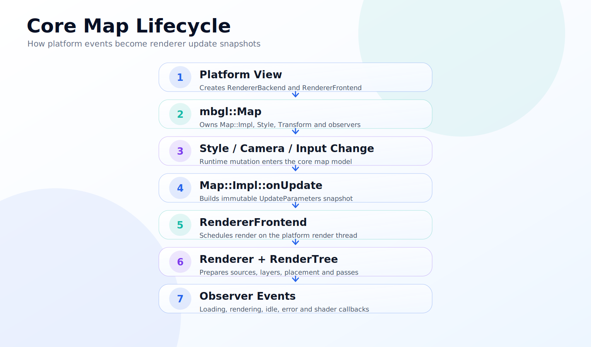

Threading model không phải “mọi thứ share lock”. `ARCHITECTURE.md` mô tả mục tiêu zero shared mutable state. Style public object có thể mutable, nhưng `Layer::Impl`, `Source::Impl`, `Image::Impl`, `Light::Impl` là immutable snapshot. Worker tile nhận data/value/ownership, xử lý parse/layout, trả kết quả. `FileSource` request bất đồng bộ và callback về thread gọi request khi có `RunLoop`.

Scheduling dùng actor/scheduler/mailbox. Android `MapRenderer` kế thừa `Scheduler`, schedule callback sang JVM để xử lý mailbox trên GL thread. Core không biết Android `Surface` hay iOS `MTKView`; core chỉ biết `RendererFrontend`, `RendererBackend`, `FileSource`, `MapObserver`. Đó là lý do core có thể sống qua nhiều SDK.

Error handling được phân loại theo observer: style parse/load/not found trong `Map::Impl::onStyleError`, tile/resource error qua `RendererObserver::onResourceError`, render error qua `onRenderError`, shader compile callbacks qua observer. Điều này quan trọng với SDK vì lỗi native phải được chuyển thành callback native platform thay vì crash im lặng.

## 3.6. Rendering Pipeline

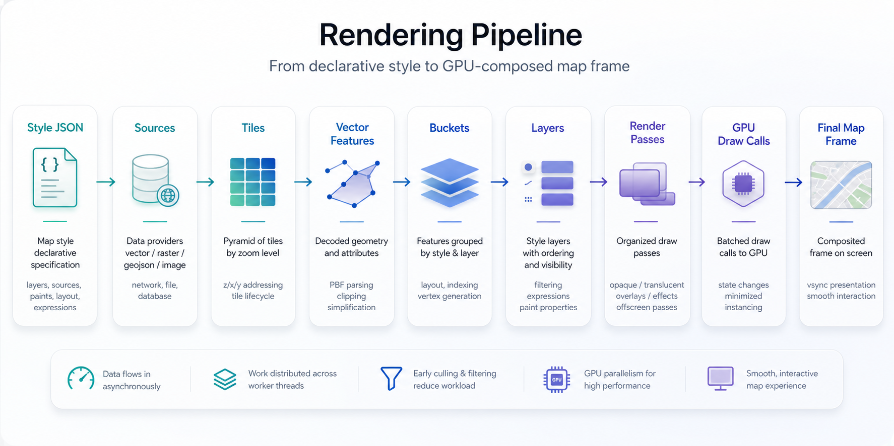

Pipeline thực tế trong source:

1. Style JSON được parse thành `Style::Impl`, `Layer::Impl`, `Source::Impl`, expression và property typed.
2. `Map::Impl::onUpdate()` đóng gói snapshot style/camera vào `UpdateParameters`.
3. `RenderOrchestrator::createRenderTree()` diff images/layers/sources, tạo hoặc update `RenderLayer`/`RenderSource`.
4. Mỗi `RenderSource` update `TilePyramid`, chọn tile theo `TransformState`, zoom range, bounds và visible layers.
5. `TileLoader` request cache trước, nếu tile cần thiết thì network; response vào `tile.setData(...)`.
6. `GeometryTileWorker` parse feature theo layer, tạo bucket, request glyph/image dependency, finalize symbol layout.
7. `RenderOrchestrator` prepare source/layer, cập nhật `CrossTileSymbolIndex`, `Placement`, `LineAtlas`, `PatternAtlas`.
8. `Renderer::Impl::render()` chạy upload pass, update layer group, upload uniforms/atlas/buffer, 3D pass nếu cần, render targets, clear, opaque pass, translucent pass, debug pass, present.

Điểm hay là renderer không vẽ trực tiếp từ style JSON. Style là cấu hình. Render tree là state đã tính cho frame. Bucket là dữ liệu GPU-ready theo layer type. Sự tách này giúp tránh parse lại toàn bộ khi camera đổi nhẹ, và tránh đụng platform khi đổi style/layer.

## 3.7. Style / Source / Layer Architecture

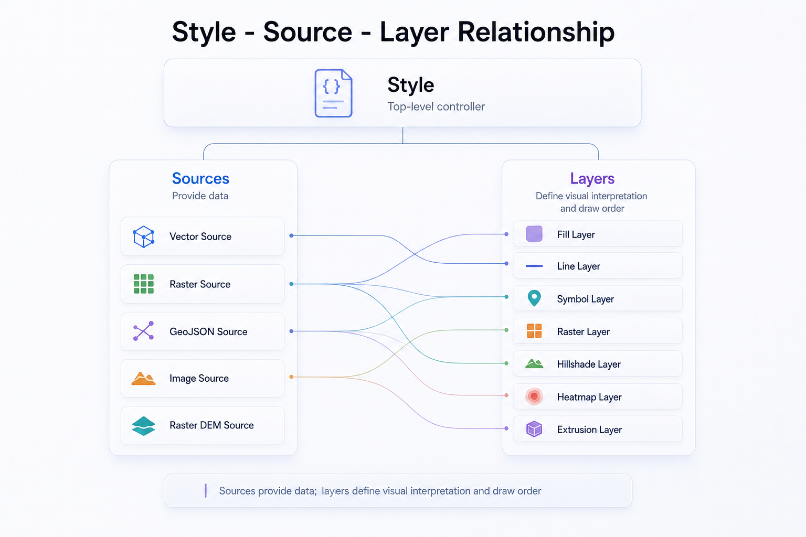

Style là bản mô tả declarative của bản đồ: nguồn dữ liệu nào, layer nào, thứ tự vẽ ra sao, property layout/paint là gì, sprite/glyph/light/transition thế nào. Source là nơi lấy dữ liệu. Layer là cách dùng dữ liệu để vẽ.

| Thành phần | Bản chất | Ví dụ | Vai trò |
| --- | --- | --- | --- |
| Style | Cấu hình bản đồ đầy đủ | `https://demotiles.maplibre.org/style.json` | Kết nối source, layer, sprite, glyph, light. |
| Source | Provider dữ liệu | vector source, raster source, GeoJSON source, raster DEM | Cung cấp tile/feature cho layer. |
| Layer | Quy tắc render | line road, fill landuse, symbol label, fill-extrusion building | Chọn source/source-layer và áp style. |
| Layout property | Ảnh hưởng bucket/layout | `symbol-placement`, `line-cap`, `text-field` | Đổi thường cần relayout/reparse tile. |
| Paint property | Ảnh hưởng visual | `line-color`, `fill-opacity`, `circle-radius` | Có thể evaluate/upload lại ít hơn. |

Kiến trúc này mạnh vì style trở thành hợp đồng độc lập giữa data team, design team và engine team. Một source đường có thể được vẽ bởi nhiều layer: casing, main road, traffic overlay, label. Một layer có thể đổi paint theo zoom/feature state mà không đổi dữ liệu tile. Đây là lý do MapLibre/Mapbox Style Spec phổ biến: nó đóng gói bản đồ thành mô hình khai báo đủ giàu nhưng vẫn render được bằng GPU.

Trong core, public `Layer`/`Source` mutable nhưng private `Impl` immutable. Mỗi thay đổi tạo impl mới. Renderer diff pointer immutable giữa frame để biết layer/source/image nào đổi. Đây là first-principles solution cho concurrency: thay vì khóa object style phức tạp giữa main/render/worker thread, engine truyền snapshot read-only.

## 3.8. Tile System

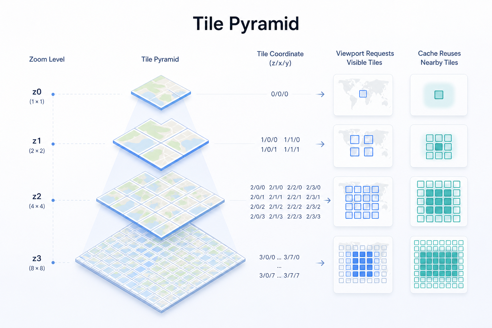

Bản đồ phải chia tile vì thế giới quá lớn để tải/render một lần. Tile biến bài toán vô hạn thành nhiều bài toán nhỏ: mỗi ô có tọa độ `(z, x, y)`, kích thước chuẩn, cache độc lập, request độc lập, parse độc lập.

| Khái niệm | Giải thích |
| --- | --- |
| Raster tile | Ảnh đã render sẵn, tốt cho imagery/satellite/heat background. |
| Vector tile | Geometry + attributes, render theo style runtime. |
| Tile pyramid | Hệ thống tile nhiều zoom; zoom cao chia nhỏ hơn. |
| Overscaled tile | Dùng tile zoom thấp hơn khi zoom cao hơn để tránh trống dữ liệu. |
| Tile coordinate | `z/x/y` cộng wrap/overscale để hỗ trợ thế giới lặp theo kinh độ. |
| Tile cache | Cache trong memory và database để giảm network/parse. |
| Offline tile | Resource được giữ trong database theo region definition. |

`TilePyramid` quản lý `tiles`, `renderedTiles`, `TileCache`, fading tile và update theo viewport. `TileLoader` khởi đầu bằng `CacheOnly` nếu `FileSource` hỗ trợ; khi tile trở nên required, nó chuyển sang network request. Response có `notModified`, `etag`, `expires`, `modified`, cho phép revalidation hiệu quả.

Vector tile lifecycle:

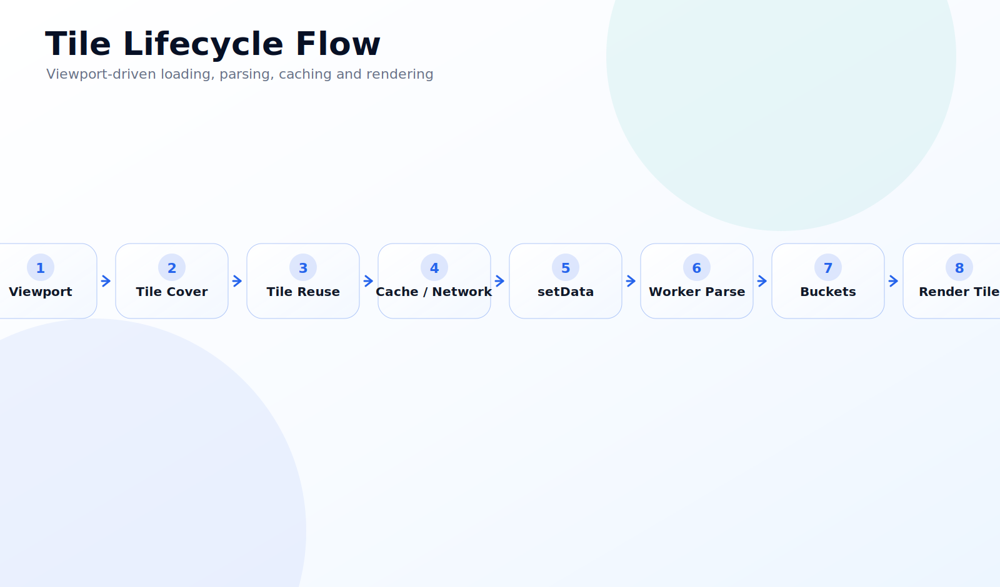

## 3.9. Platform Abstraction

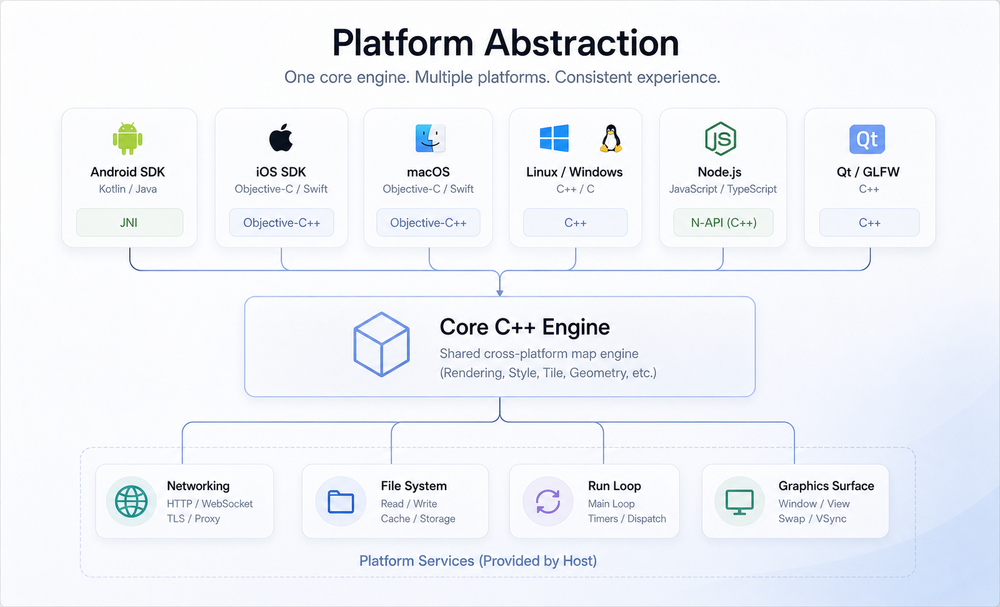

| Platform | Ngôn ngữ/API | Kết nối với core | Vai trò |
| --- | --- | --- | --- |
| Android | Java/Kotlin API + C++ JNI | `NativeMapView`, `MapRenderer`, JNI peer classes | `MapView`, gesture, lifecycle, render surface, Android resource/network bridge. |
| iOS | Objective-C/Swift-facing API, ObjC++ implementation | `MLNMapView`, `MLNRenderFrontend`, C++ `Map` | UIKit view, delegate callbacks, style/source/layer wrapper, Metal/OpenGL/WebGPU backend. |
| macOS/Darwin | Objective-C++ shared layer | `platform/darwin` shared `MLN*` classes | Chia sẻ networking, style wrappers, offline, custom layer giữa iOS/macOS. |
| Linux/GLFW | C++ desktop wrapper | GL renderer backend/headless/demo tools | Development, testing, server-side render/snapshot. |
| Node.js/Qt/Other | Wrapper riêng hoặc external repo | Core C++ API + platform backends | Tái sử dụng engine ngoài mobile. |

Platform abstraction trong MapLibre Native không phải một lớp mỏng duy nhất. Nó gồm nhiều hợp đồng: `RendererFrontend` để schedule render, `RendererBackend` để cung cấp context/renderable, `FileSource` để request resource, `MapObserver`/`RendererObserver` để callback lifecycle, và binding object để convert type giữa native platform và C++.

## 3.10. Android Architecture

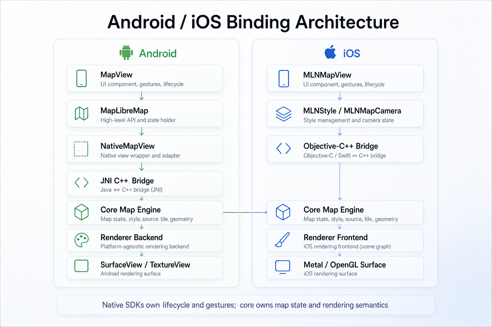

Android SDK nằm chủ yếu trong `platform/android/MapLibreAndroid`. `MapView` là `FrameLayout` public cho app. Nó tạo drawing surface, `NativeMapView`, `MapLibreMap`, `Projection`, `UiSettings`, annotation containers, `Transform`, `MapGestureDetector`, `LocationComponent`.

JNI layer nằm trong `platform/android/MapLibreAndroid/src/cpp`. `NativeMapView` kế thừa `MapObserver` và expose nhiều method camera/style/query/annotation sang Java. `MapRenderer` là peer native cho `org.maplibre.android.maps.renderer.MapRenderer`, giữ `AndroidRendererBackend`, `Renderer`, `ActorRef<Renderer>`, `ANativeWindow`, update parameters và mailbox.

Luồng Android:

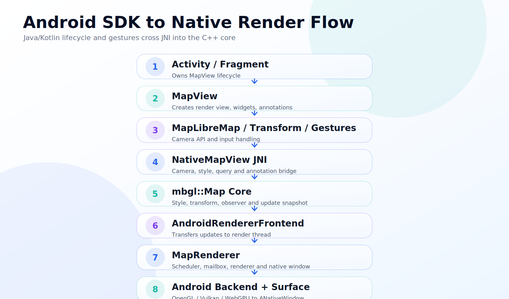

Gesture handling nằm ở Java/Kotlin layer vì nó phụ thuộc Android input system. Nhưng gesture chỉ biến thành camera operations: move, ease, fly, rotate, pitch, zoom. Core không phụ thuộc `MotionEvent`.

Render surface và lifecycle là điểm nhạy cảm. `MapRenderer` note rõ public methods an toàn gọi từ main thread, còn render chạy trên GL thread. Nó schedule mailbox bằng callback JVM, giữ mutex cho update parameters và window state. Đây là pattern tốt cho Gofa: không để business logic gọi trực tiếp GPU object; đi qua scheduler/actor boundary.

## 3.11. iOS Architecture

iOS SDK dùng `MLNMapView` làm public UIKit view. `MLNMapView.mm` tạo `MLNMapViewImpl::Create(self)` để chọn backend theo compile flag: Metal, WebGPU hoặc OpenGL. Sau đó tạo `mbgl::Renderer`, `MLNRenderFrontend`, `mbgl::MapOptions`, `ResourceOptions`, rồi tạo core `Map`.

`MLNRenderFrontend` implement `mbgl::RendererFrontend`: giữ `Renderer`, weak `MLNMapView`, backend reference, `UpdateParameters`; khi core update, nó gọi `[nativeView setNeedsRerender]`; khi render, nó tạo `BackendScope` và gọi `renderer->render(...)`.

Metal integration nằm ở `MLNMapView+Metal.mm`: dùng `MTKView`, `MTLCommandQueue`, `MTLCommandBuffer`, `CAMetalDrawable`, `CAMetalLayer`, pixel format `BGRA8Unorm`, depth/stencil `Depth32Float_Stencil8`. OpenGL integration nằm ở `MLNMapView+OpenGL.mm` với `EAGLContext`/`CAEAGLLayer`. WebGPU integration dùng Dawn/Metal surface. API public ObjC/Swift không cần biết backend cụ thể.

Điểm đáng học: iOS wrapper chuyển mọi callback core thành delegate/event UIKit (`mapViewWillStartRenderingFrame`, `mapViewDidFinishLoadingStyle`, `sourceDidChange`, shader compile events). Đây là cách giữ native developer experience trong khi core vẫn C++.

## 3.12. Graphics Backend

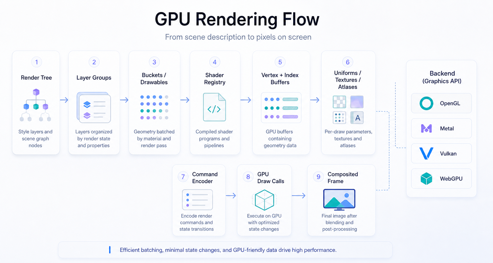

MapLibre Native đã tiến hóa từ OpenGL-centric sang backend modular. Source hiện có các backend:

| Backend | Source | Tình trạng/ý nghĩa |
| --- | --- | --- |
| OpenGL | `src/mbgl/gl`, `include/mbgl/gl` | Backend lâu đời, rộng platform, nhưng legacy/deprecated trên Apple. |
| Metal | `src/mbgl/mtl`, `include/mbgl/mtl`, `platform/ios/src/MLNMapView+Metal.mm` | Hướng chính cho Apple, command buffer/render pass/native tooling tốt hơn. |
| Vulkan | `src/mbgl/vulkan`, `include/mbgl/vulkan`, Android backend files | Hướng native hiện đại cho Android/desktop, explicit GPU control. |
| WebGPU | `src/mbgl/webgpu`, `include/mbgl/webgpu`, Dawn integration | Hướng abstraction hiện đại, gần với Rust `wgpu` về mô hình. |
| `gfx` abstraction | `src/mbgl/gfx` | Interface chung: context, renderer backend, drawable, upload pass, render pass, textures, buffers. |

`Renderer::Impl` không gọi OpenGL/Metal API trực tiếp trong phần lớn logic. Nó gọi `context`, `encoder`, `UploadPass`, `RenderPass`, `LayerGroup`, `Drawable`. Backend cụ thể chịu trách nhiệm tạo shader, buffer, texture, command encoder, renderable.

Điểm mạnh: có đường mở cho Metal/Vulkan/WebGPU mà không viết lại style/tile/layout. Điểm yếu: abstraction đồ họa phức tạp, cần giữ parity giữa backend, shader và render test. Với Gofa nếu muốn Rust + `wgpu`, MapLibre gợi ý mô hình tốt: giữ style/tile/camera độc lập backend; tạo abstraction rõ cho buffer/texture/render pass/drawable; nhưng cần đầu tư render-test rất sớm.

## 3.13. Networking, Cache, Offline

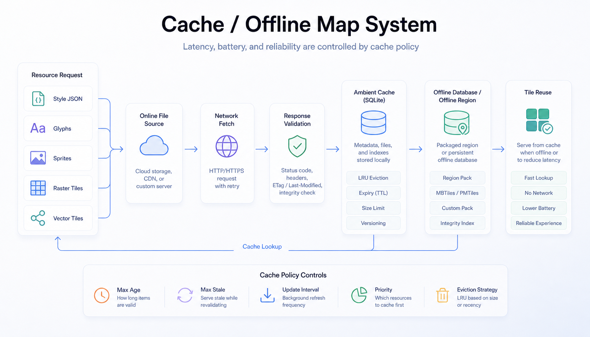

`FileSource` là abstraction trung tâm cho resource loading. Nó có các loại: Asset, Database, FileSystem, Network, Mbtiles, Pmtiles, ResourceLoader. `FileSourceManager` cache file source theo tuple type + baseURL + apiKey + cachePath + platformContext.

Tile request không đơn giản là GET URL:

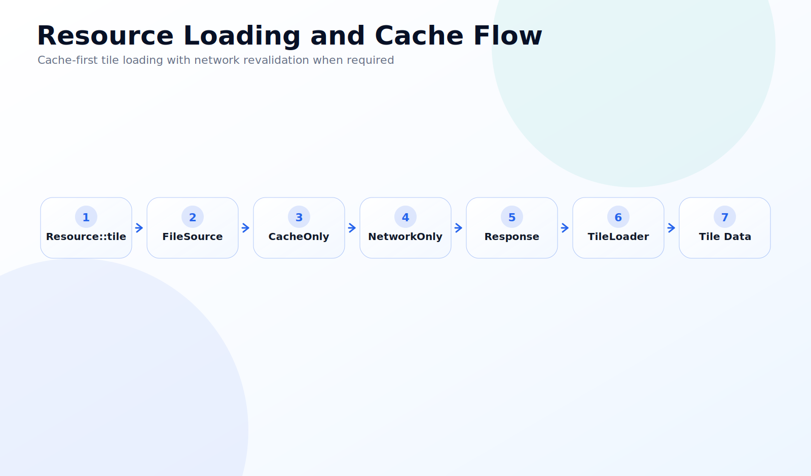

`DatabaseFileSource` gom ambient cache và offline APIs: reset/pack database, invalidate/clear ambient cache, set maximum ambient cache size, create/list/delete/invalidate offline regions, observer status, merge offline regions. Tài liệu source còn có TODO tách Ambient cache và Database interfaces, cho thấy đây là vùng kỹ thuật có lịch sử phức tạp.

Performance implication: cache hit không chỉ tiết kiệm network, mà còn giảm latency trước khi parse tile. Offline region cần policy rõ vì dữ liệu offline chiếm storage, có invalidation/revalidation và có thể cạnh tranh với ambient cache.

## 3.14. Performance Architecture

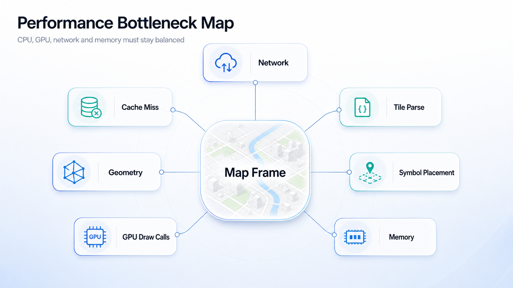

Map rendering dễ nóng máy và tốn pin vì nó cùng lúc dùng network, CPU, memory và GPU. Khi người dùng pan/zoom/pitch, engine phải tính tile cover, request tile, parse MVT, shape text, đặt symbol, upload buffer/texture và submit draw calls liên tục.

| Bottleneck | Dấu hiệu | Cách MapLibre giảm áp lực | Bài học cho navigation |
| --- | --- | --- | --- |
| CPU geometry processing | Pan/zoom giật khi nhiều feature | Worker tile, bucket theo layer type, layout diff | Không parse route/traffic overlay trên main thread. |
| Symbol placement | Label nhảy/chậm, CPU spike | `Placement`, `CrossTileSymbolIndex`, coalesced placement | Route label, POI, instruction banner phải có cadence update. |
| GPU draw calls | GPU busy, battery drain | Opaque/translucent pass, layer group, drawable abstraction | Gộp overlay, tránh mỗi marker thành một draw call. |
| Network tile loading | Blank tile, delayed map | CacheOnly trước NetworkOnly, `FileSource`, prefetch | Offline corridor và prefetch theo route. |
| Memory pressure | Low memory/crash | Tile cache, reduceMemoryUse, atlas management | Giới hạn route alternatives, traffic history, icon atlas. |
| Cache miss | Tải lại nhiều | Database cache/offline region/etag revalidation | Cache theo vùng hoạt động và tuyến thường đi. |

Một chi tiết quan trọng trong `GeometryTileWorker`: nó là state machine có coalescing để khi nhiều `setData/setLayers/symbolDependenciesChanged` đến liên tục, worker không bị starvation nhưng cũng không trả kết quả nửa vời. Đây là bài học lớn cho Gofa khi cập nhật traffic/location nhanh: coalesce update theo frame hoặc theo tile/segment, không xử lý mọi event ngay lập tức.

## 3.15. Extension Points

MapLibre Native có nhiều điểm mở rộng:

| Extension point | Cách dùng | Rủi ro |
| --- | --- | --- |
| Runtime style API | Add/remove layer/source, đổi paint/layout | Layout property có thể trigger relayout nhiều tile. |
| Custom source | GeoJSON/custom geometry/tile source | Cần quản lý lifecycle và thread safety. |
| Custom layer / custom drawable layer | Vẽ nội dung riêng vào render pipeline | Phụ thuộc backend, đặc biệt khi chuyển GL sang Metal/WebGPU. |
| Annotation | Marker, polygon, polyline, shape annotation | Dễ dùng nhưng nhiều annotation có thể kém hơn source/layer chuyên dụng. |
| Offline map | Offline region, ambient cache | Storage policy và invalidation phải rõ. |
| Navigation overlay | Route line, maneuver arrow, traffic, puck | Nên là source/layer riêng để GPU render batch. |
| 3D/terrain/building | Fill extrusion, DEM/raster DEM, 3D pass | Tăng depth/pass complexity và GPU memory. |
| Plugin layer | Design proposal 2025 | Hứa hẹn mở rộng layer ít sửa core hơn, nhưng cần theo dõi maturity. |

## 3.16. Architectural Value

| Giá trị | Ý nghĩa | Vì sao quan trọng |
| --- | --- | --- |
| Cross-platform core | Một C++ engine dùng chung | Đồng nhất render behavior giữa Android/iOS, giảm bug platform-specific. |
| Separation of concerns | App, SDK, core, style, tile, renderer tách rời | Cho phép thay backend mà không đổi style/tile; đổi SDK mà không đổi core. |
| Declarative style | Style JSON là contract | Design/data/runtime update linh hoạt, ecosystem-compatible. |
| GPU-first rendering | Drawable, bucket, pass, shader registry | Đạt performance native cho vector map phức tạp. |
| Tile-based scalability | Chỉ xử lý viewport | Scale từ thành phố tới toàn cầu. |
| Native performance | Threading, cache, platform surface | Phù hợp navigation và app cần interaction liên tục. |
| Extensibility | Runtime style, custom layer/source, offline | Cho phép product-specific overlays. |
| Ecosystem compatibility | MapLibre/Mapbox Style Spec, MVT, PMTiles/MBTiles | Dễ dùng data/style/tooling hiện có. |

## 3.17. Bài Học Cho Gofa

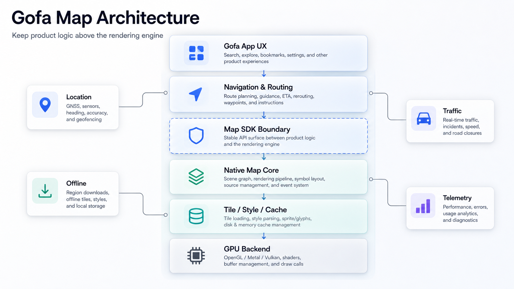

| Bài học | Ứng dụng cho Gofa | Mức độ ưu tiên |
| --- | --- | --- |
| Đừng trộn navigation logic vào renderer | Route matching, ETA, reroute, traffic nằm trên map SDK boundary | Rất cao |
| Dùng source/layer cho overlay động | Route line, traffic segment, destination, pickup/dropoff là vector/GeoJSON source + styled layers | Rất cao |
| Coalesce realtime updates | Location/traffic không nên mutate style mỗi event; batch theo frame hoặc interval | Rất cao |
| Offline corridor | Prefetch/cache theo tuyến và vùng lân cận, không chỉ viewport hiện tại | Cao |
| Giữ core map vendor boundary | Bao MapLibre trong adapter riêng để dễ nâng cấp/fork | Cao |
| Custom native layer có chọn lọc | Chỉ custom khi source/layer không đủ, ví dụ advanced puck/AR/3D effect | Trung bình |
| Fork khi cần engine-level change | Fork nếu phải đổi renderer/cache/offline/threading sâu | Trung bình |
| Contribute upstream khi thay đổi generic | Bug backend, style spec, render correctness, platform lifecycle nên upstream | Cao |
| Rust + wgpu cần render-test trước | Nếu tự xây engine, tạo visual regression suite trước khi nhiều layer | Rất cao |
| Không tối ưu sớm bằng rewrite | Dùng MapLibre Native để ship, đo bottleneck thật rồi mới chọn Rust/wgpu | Rất cao |

Khuyến nghị kiến trúc cho Gofa giai đoạn thực dụng:

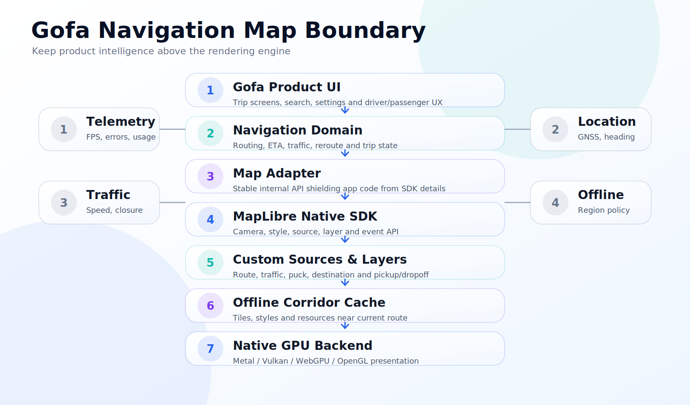

Khi nào dùng trực tiếp: nếu yêu cầu là bản đồ vector, route overlay, traffic, offline cơ bản, Android/iOS parity. Khi nào custom: nếu cần route rendering đặc thù, location puck cao cấp, traffic animation, cache theo hành lang tuyến, telemetry/performance hooks. Khi nào tránh phụ thuộc sâu: không để business logic gọi trực tiếp `MLN*`, `MapLibreMap`, JNI/native object ở khắp app; gom vào adapter. Khi nào fork: nếu cần thay đổi render backend, tile cache database policy, offline download scheduler, hoặc bug critical chưa được upstream giải quyết. Khi nào contribute upstream: nếu fix liên quan render correctness, lifecycle, style spec, backend parity, crash phổ quát.

Nếu muốn Rust + `wgpu`, MapLibre Native gợi ý ba nguyên tắc: một là style/tile/camera độc lập backend; hai là render pass/drawable/texture/buffer phải có abstraction chặt; ba là symbol placement và tile worker mới là phần khó không kém GPU API.

## 3.18. Glossary

| Thuật ngữ | Giải thích dễ hiểu | Bản chất kỹ thuật | Ví dụ |
| --- | --- | --- | --- |
| Vector tile | Ô dữ liệu bản đồ chứa hình học | MVT/MLT geometry + properties theo tile coordinate | Road/landuse/building trong tile `z/x/y`. |
| Raster tile | Ô ảnh bản đồ | PNG/JPEG/WebP tile đã render sẵn | Satellite imagery. |
| Tile pyramid | Lưới tile nhiều mức zoom | Quadtree theo zoom level | Zoom 0 có ít tile, zoom 14 có rất nhiều tile. |
| Style JSON | File mô tả bản đồ | MapLibre Style Spec | Source vector + layer road/label. |
| Source | Nguồn dữ liệu cho layer | Vector/raster/GeoJSON/image/DEM source | `openmaptiles` vector source. |
| Layer | Quy tắc vẽ dữ liệu | Style layer có layout/paint/filter | `road-primary`, `place-label`. |
| Renderer | Thành phần tạo frame | `Renderer`, `Renderer::Impl`, backend context | Render một frame vào surface. |
| Render pass | Một lượt render có state đích | Upload, 3D, opaque, translucent, debug | Opaque pass trước translucent pass. |
| Bucket | Dữ liệu GPU-ready theo layer/tile | Vertex/index buffers và segment | `LineBucket`, `SymbolBucket`. |
| Symbol placement | Đặt nhãn/icon tránh va chạm | Collision index + placement state | Tên đường không chồng nhau. |
| Camera | Vị trí nhìn bản đồ | center, zoom, bearing, pitch, padding | Follow vehicle heading. |
| Viewport | Vùng màn hình đang nhìn | Size + transform + frustum | MapView 390x844 px. |
| Annotation | Đối tượng overlay tiện dụng | Marker/line/polygon API wrapper | Pin điểm đón. |
| JNI | Cầu nối Java/Kotlin với C++ | Java Native Interface | `NativeMapView` gọi `mbgl::Map`. |
| Native binding | Lớp chuyển API platform sang core | ObjC++/JNI wrappers | `MLNMapView`, `NativeMapView`. |
| GPU draw call | Lệnh GPU vẽ geometry | Bind shader/buffer/texture rồi draw | Vẽ layer road line. |
| Cache | Lưu resource để dùng lại | Memory cache + database cache | Tile cache offline/ambient. |
| Offline map | Bản đồ dùng không mạng | Offline region + database resources | Tải trước thành phố/tuyến. |
| Geometry | Hình học không gian | Point/LineString/Polygon coordinates | Đường, hồ, tòa nhà. |
| Feature | Geometry + thuộc tính | GeoJSON/MVT feature | Road có `class=primary`. |
| MVT | Mapbox Vector Tile | Protobuf vector tile format | `*.pbf` vector tile. |
| Projection | Phép chiếu địa lý lên mặt phẳng | Web Mercator/projection math | LatLng sang tile coordinate. |
| Coordinate system | Hệ tọa độ | WGS84, screen px, tile units, world units | LatLng → projected meters → screen point. |

## Phụ Lục: Sơ Đồ Luồng Core

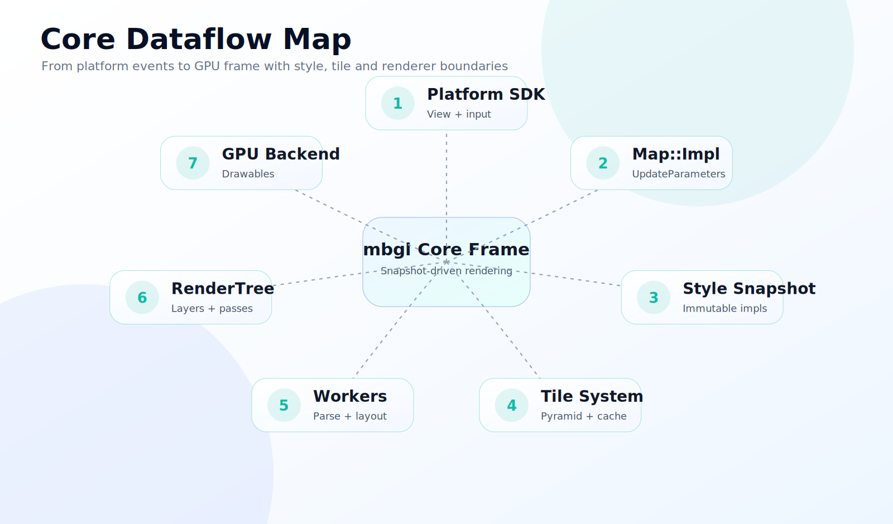

## Phụ Lục: Danh Sách Phát Hiện Kiến Trúc Quan Trọng

1. `Map::Impl::onUpdate()` là điểm giao giữa style/camera/platform và renderer; nó tạo snapshot `UpdateParameters`.
2. Style immutable impl + diff là thiết kế nền tảng để giảm lock và hỗ trợ render/worker thread.
3. `RenderOrchestrator` là “bộ não frame”: diff style, update render source/layer, prepare placement, dựng `RenderTree`.
4. `GeometryTileWorker` là state machine coalescing; đây là giải pháp chống starvation khi tile/layer/glyph/image update liên tục.
5. `TileLoader` ưu tiên cache-only trước network-only, giúp map có khả năng lấp dữ liệu nhanh và tiết kiệm network.
6. Renderer hiện đại đi qua `gfx` abstraction, upload pass, layer group, render targets, drawables; không còn là OpenGL-only mindset.
7. Android và iOS SDK không nên được xem là “thin wrappers”; chúng quản lý lifecycle, surface, input, callback và thread boundary rất quan trọng.
8. Offline/cache là một phần của architecture, không phải tiện ích phụ. Navigation cần thiết kế cache/offline từ đầu.
